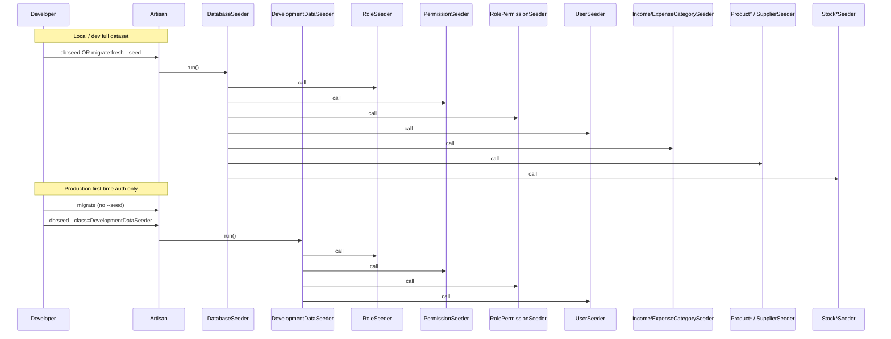

# Database Seeding Strategy Sequence

## Purpose

This document defines how database seeders are grouped for **local/dev full datasets** versus **production initial auth setup**. Each model keeps its own dedicated seeder file; `DatabaseSeeder` and `DevelopmentDataSeeder` only call other seeders (no inline data arrays).

## Seeder entry points

| Command | Seeder class | What runs |
|---------|--------------|-----------|
| `php artisan db:seed` | `DatabaseSeeder` | Auth + finance categories + catalog + suppliers + stock (full local/dev dataset) |
| `php artisan migrate:fresh --seed` | `DatabaseSeeder` | Same as above (after migrations) |
| `php artisan db:seed --class=DevelopmentDataSeeder` | `DevelopmentDataSeeder` | Roles, permissions, role–permission map, users **only** |
| `php artisan db:seed --class=SomeSeeder` | Named seeder | That seeder only (tests or targeted QA) |

## Sequence flow

## `DatabaseSeeder` call order

1. `RoleSeeder`
2. `PermissionSeeder`
3. `RolePermissionSeeder`
4. `UserSeeder`
5. `IncomeCategorySeeder`
6. `ExpenseCategorySeeder`
7. `ProductCategorySeeder`
8. `ProductSeeder`
9. `ProductUnitSeeder`
10. `SupplierSeeder`
11. `StockBatchSeeder`
12. `StockBalanceSeeder`
13. `StockLedgerSeeder` (uses an admin or active user for `created_by` when present)

## Manual QA — local full seed

1. Run `php artisan migrate:fresh --seed`.
2. Confirm `roles`, `permissions`, `role_permission`, and `users` are populated.
3. Confirm `income_categories` and `expense_categories` have defaults.
4. Confirm `products`, `product_units`, `suppliers`, `stock_batches`, `stock_balances`, and `stock_ledgers` have sample rows.
5. Log in as `admin@zarliminnew.test` / `password`.

## Manual QA — production auth-only setup

1. Run `php artisan migrate` (do **not** use `--seed` on production unless you intend a full dev dataset).
2. Run `php artisan db:seed --class=DevelopmentDataSeeder`.
3. Confirm `roles`, `permissions`, `role_permission`, and `users` exist.
4. Confirm `products` (and other catalog/stock tables) are **empty** unless you added data manually.
5. Create or adjust real staff users in **Configurations → Users** as needed.

## Database checks

- `DatabaseSeeder` must not contain raw insert arrays; only `$this->call([...])`.
- `DevelopmentDataSeeder` must not call product, stock, or finance category seeders.
- Re-running either entry seeder is safe where child seeders use `updateOrCreate`.

## Related files

- `database/seeders/DatabaseSeeder.php`
- `database/seeders/DevelopmentDataSeeder.php`
- Dedicated seeders under `database/seeders/`
