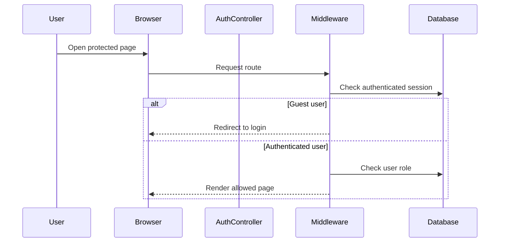

# Phase 1, Epic 1 - Project Foundation Sequence

## Purpose

This document explains the foundation flow for authentication, dashboard access, and role checks.

## Sequence Flow

## Manual QA

1. Open `/dashboard` as a guest and verify redirect to `/login`.
2. Log in as seeded admin.
3. Verify dashboard loads.
4. Verify sidebar links render.
5. Log out and confirm protected pages redirect again.

## Database Checks

- Confirm `users.role` exists.
- Confirm seeded admin has `role = admin`.
- Confirm no duplicate session or auth tables were created in grouped migrations.
