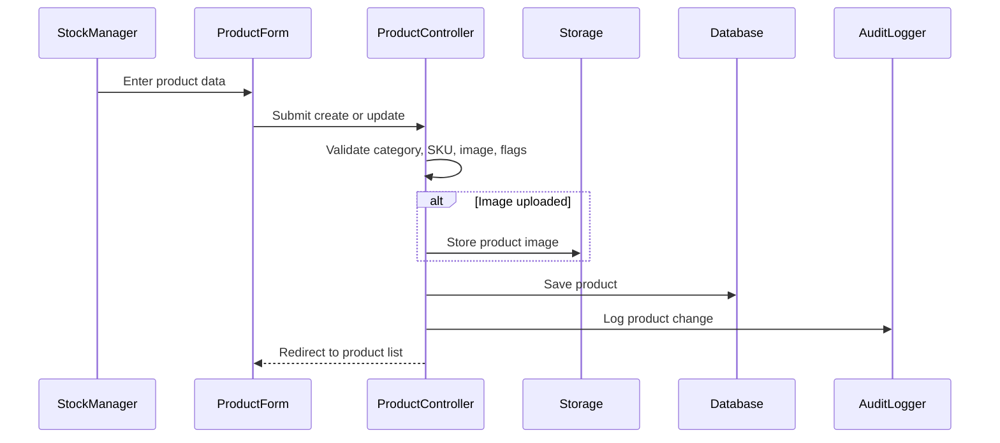

# Phase 1, Epic 2 - Product Catalog Sequence

## Purpose

This document explains product category and product setup, including image upload and catalog display.

## Sequence Flow

## Manual QA

1. Create a category.
2. Create a product with name, SKU, category, generic name, manufacturer, flags, and image.
3. Verify product appears in Product List with image.
4. Edit product image and verify old image is replaced.
5. Try duplicate SKU and verify validation error.

## Database Checks

- Check `products.image_path` is populated after upload.
- Check `products.sku` remains unique.
- Check `audit_logs` contains product create/update actions.
