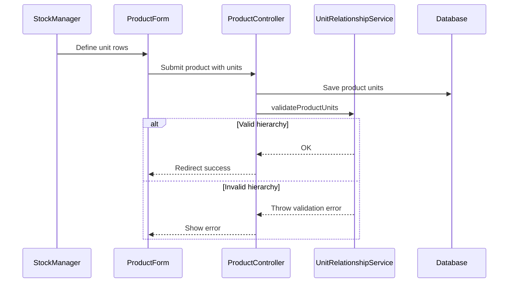

# Phase 1, Epic 3 - Unit Management Engine Sequence

## Purpose

This document explains product unit setup and relationship validation.

## Sequence Flow

## Manual QA

1. Create product units such as Box, Strip, Pill.
2. Set `1 Box = 10 Strips` and `1 Strip = 10 Pills`.
3. Verify sale price and barcode can be set per unit.
4. Try zero or negative conversion factor and verify rejection.
5. Try mismatched or circular parent relationships and verify rejection.

## Database Checks

- Check `product_units.product_id` belongs to the correct product.
- Check `parent_product_unit_id` points to the parent unit.
- Check `conversion_factor` is positive for child units.
