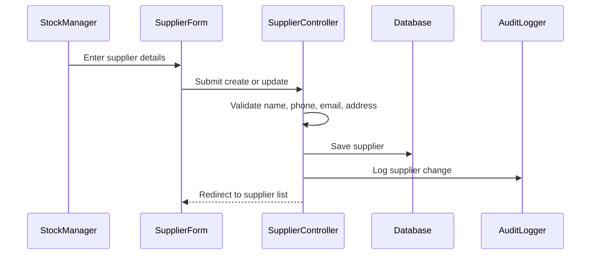

# Phase 1, Epic 4 - Supplier Management Sequence

## Purpose

This document explains supplier CRUD and how suppliers become available for purchase receipts.

## Sequence Flow

## Manual QA

1. Create a supplier with name, phone, email, and address.
2. Verify supplier appears in Supplier List.
3. Edit supplier details and verify changes persist.
4. Confirm active supplier appears in Purchase Receipt supplier dropdown.
5. Try submitting without supplier name and verify validation error.

## Database Checks

- Check `suppliers.name` is populated.
- Check `suppliers.is_active` controls dropdown visibility.
- Check supplier create/update audit logs exist.
