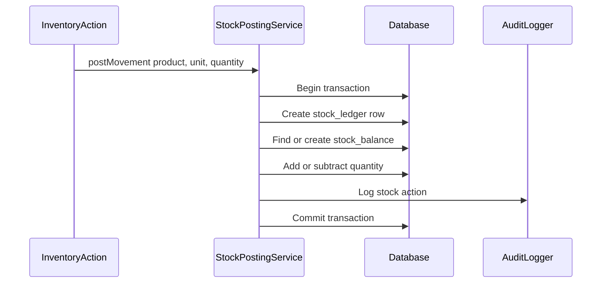

# Phase 1, Epic 5 - Inventory Ledger Sequence

## Purpose

This document explains how stock ledger and stock balance records are posted through `StockPostingService`.

## Sequence Flow

## Manual QA

1. Post opening stock or purchase receipt.
2. Verify a `stock_ledgers` row is created.
3. Verify `stock_balances` has matching product, unit, batch, and quantity.
4. Verify ledger row remains unchanged after posting.
5. Verify stock list shows readable quantities.

## Database Checks

- Check `stock_ledgers.direction` is `in` for Phase 1 stock-in.
- Check `stock_ledgers.product_unit_id` is the exact transaction unit.
- Check `stock_balances.quantity` updates in the same unit.
