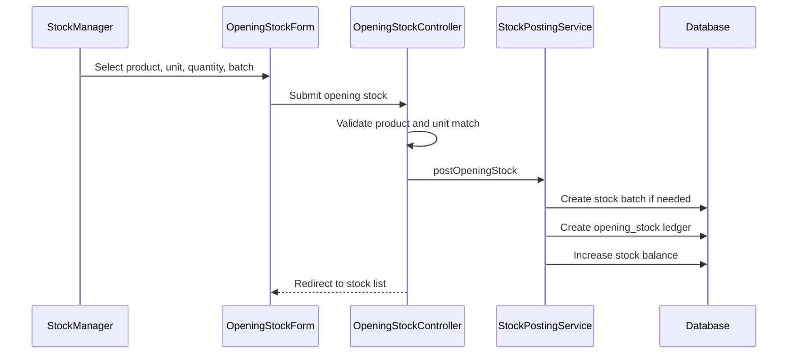

# Phase 1, Epic 6 - Opening Stock Sequence

## Purpose

This document explains how initial stock is posted for a product and unit.

## Sequence Flow

## Manual QA

1. Select an active product.
2. Select a unit that belongs to that product.
3. Enter quantity and batch/expiry if required.
4. Submit opening stock.
5. Verify stock list increases by selected quantity.
6. Try selecting a unit from another product and verify rejection.

## Database Checks

- Check `stock_ledgers.type = opening_stock`.
- Check `stock_ledgers.direction = in`.
- Check `stock_balances.quantity` increased.
- Check `stock_batches` exists when batch or expiry tracking is enabled.
