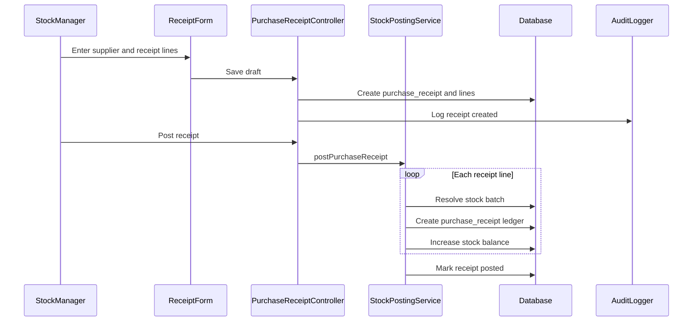

# Phase 1, Epic 7 - Purchase Receiving Sequence

## Purpose

This document explains draft purchase receipt creation and posting stock-in to inventory.

## Sequence Flow

## Manual QA

1. Create a draft purchase receipt.
2. Add at least one product line with product, unit, quantity, cost, batch, and expiry when required.
3. Save draft.
4. Open receipt and click post.
5. Verify receipt status becomes posted.
6. Verify posted receipt is read-only.

## Database Checks

- Check `purchase_receipts.status = posted`.
- Check `purchase_receipt_lines` preserve exact bought unit and quantity.
- Check `stock_ledgers.type = purchase_receipt`.
- Check `stock_balances.quantity` increased for each line.
