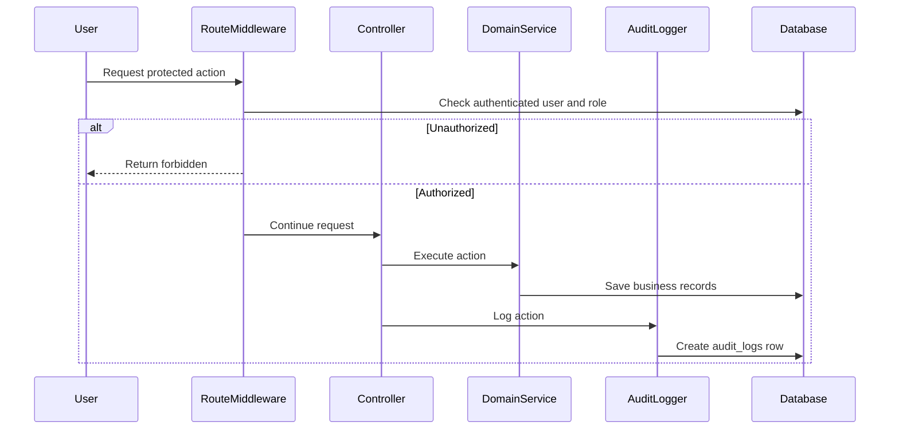

# Phase 1, Epic 8 - Audit And Security Sequence

## Purpose

This document explains role protection and audit logging for critical Phase 1 actions.

## Sequence Flow

## Manual QA

1. Log in as stock manager and verify allowed inventory/catalog pages work.
2. Log in as cashier and verify Phase 1 write pages are blocked.
3. Create or update product, supplier, opening stock, or purchase receipt.
4. Verify audit logs are created for critical actions.
5. Verify guest users are redirected to login.

## Database Checks

- Check `audit_logs.action` records expected action names.
- Check `audit_logs.user_id` matches current user.
- Check `audit_logs.auditable_type` and `auditable_id` point to changed model.
