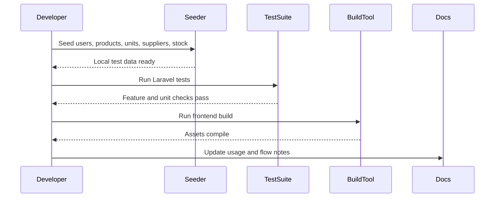

# Phase 1, Epic 9 - QA And Documentation Sequence

## Purpose

This document explains the QA and documentation checks used to verify Phase 1 readiness.

## Sequence Flow

## Manual QA

1. Run `php artisan db:seed` (full `DatabaseSeeder`) for local QA.
2. Confirm seeded admin/cashier users exist.
3. Confirm sample categories, products, units, suppliers, and stock exist.
4. Run tests.
5. Run frontend build.
6. Review Phase 1 usage notes and flow docs.

## Database Checks

- Check dedicated seeders populate expected tables when running `php artisan db:seed`.
- Check `DatabaseSeeder` and `DevelopmentDataSeeder` only use `$this->call([...])` (no inline model arrays).
- Check production setup uses `DevelopmentDataSeeder` per `docs/flows/database-seeding-strategy-sequence.md`.
- Check one-table-per-migration rule is respected.
