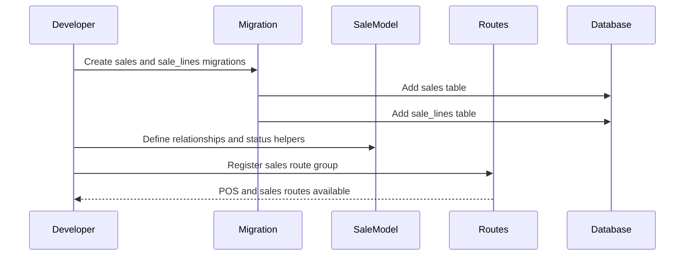

# Phase 2, Epic 1 - Sales Foundation Sequence

## Purpose

This document explains the sales persistence foundation: sales tables, sale line models, and sales route group.

## Sequence Flow

## Manual QA

1. Run migrations.
2. Confirm `sales` table exists.
3. Confirm `sale_lines` table exists.
4. Confirm `Sale` has many `SaleLine` records.
5. Confirm sale belongs to cashier through `sold_by`.
6. Confirm sales routes require auth and role access.

## Database Checks

- Check `sales.patient_visit_id` is nullable.
- Check `sales.sale_number` is unique.
- Check `sale_lines.product_unit_id` preserves exact sold unit.
- Check no stock ledger rows are created by foundation setup alone.
