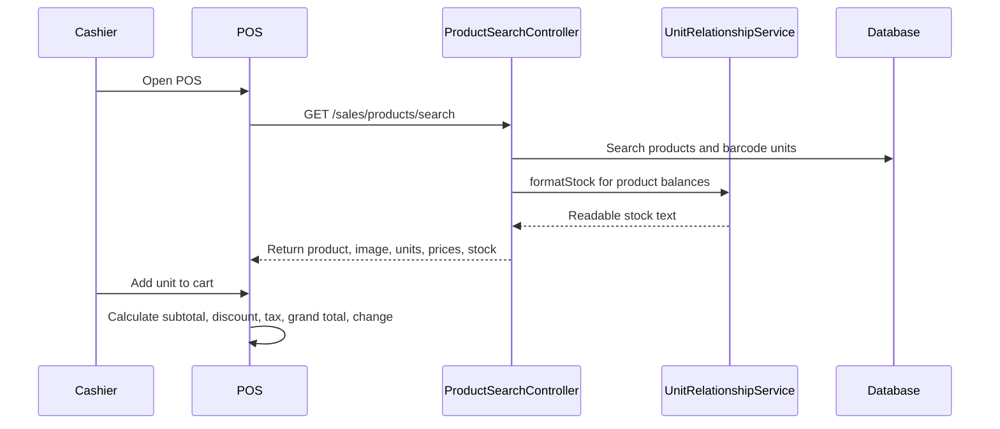

# Phase 2, Epic 2 - POS Cart And Product Search Sequence

## Purpose

This document explains the POS screen, product search endpoint, optional patient selector, and client-side cart calculation.

## Sequence Flow

## Manual QA

1. Log in as cashier.
2. Open POS.
3. Search by product name.
4. Search by SKU.
5. Search by unit barcode.
6. Verify product cards show image or fallback initial.
7. Add product unit to cart.
8. Change unit, quantity, and unit price.
9. Verify subtotal, discount, tax, grand total, amount paid, and change update.
10. Verify patient selector is optional and defaults to `No patient selected`.

## Database And Service Checks

- Product search should only return active products with sale-enabled units.
- Product search response should include sale prices per unit.
- Product search should call stock formatting through `UnitRelationshipService`.
- POS cart calculations are client-side only until checkout.
- No `sales`, `sale_lines`, `stock_ledgers`, or `stock_balances` changes should occur from searching or adding to cart.
