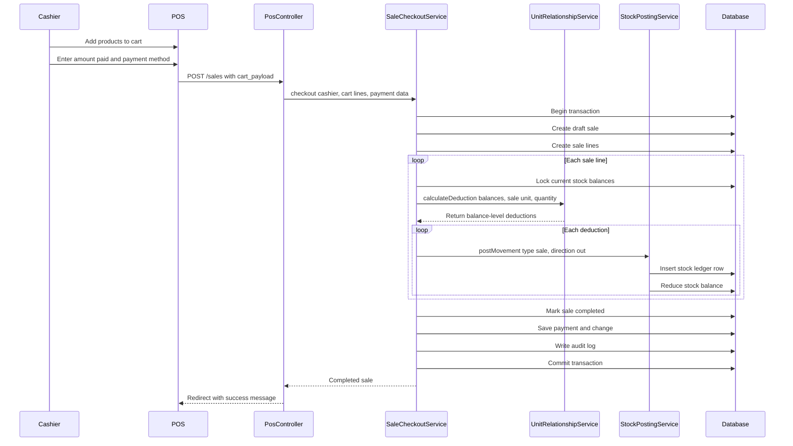

# Phase 2, Epic 3 - Sale Checkout Sequence

## Purpose

This document explains how POS checkout completes a sale, posts stock-out ledger rows, and reduces stock balances. Use it to manually verify database changes before approving Phase 2, Epic 3.

## Sequence Flow

## Database Records To Verify

After a successful checkout, verify:

- `sales.status` is `completed`.
- `sales.sold_by` is the cashier user ID.
- `sales.sold_at` is not null.
- `sales.patient_visit_id` can be null.
- `sale_lines.product_unit_id` stores the exact unit sold.
- `sale_lines.quantity` stores the exact quantity sold.
- `stock_ledgers.type` is `sale`.
- `stock_ledgers.direction` is `out`.
- `stock_ledgers.reference_type` is `App\Models\Sale`.
- `stock_ledgers.reference_id` points to the completed sale.
- `stock_balances.quantity` is reduced in the deducted stock unit.
- `audit_logs.action` includes `sale.completed`.

## Manual Test 1 - Same Unit Deduction

Goal: selling strips from strip stock should deduct strips directly.

1. Log in as a cashier.
2. Ensure a product has a sale unit `Strip`.
3. Ensure stock balance exists for that product in `Strip`, for example `10 strip`.
4. Open POS.
5. Add the product as `Strip`.
6. Set quantity to `2`.
7. Enter amount paid greater than or equal to the grand total.
8. Complete the sale.
9. Verify `sale_lines.product_unit_id` is the `Strip` unit ID.
10. Verify `stock_ledgers.product_unit_id` is also the `Strip` unit ID.
11. Verify `stock_ledgers.quantity` is `2`.
12. Verify `stock_balances.quantity` changed from `10` to `8`.

## Manual Test 2 - Fractional Larger Unit Deduction

Goal: selling pills from box stock should deduct a fraction of the box.

Example relationship:

- `1 Box = 10 Strips`
- `1 Strip = 10 Pills`
- Therefore, `1 Box = 100 Pills`

Steps:

1. Ensure a product has units `Box -> Strip -> Pill`.
2. Ensure stock balance exists only in `Box`, for example `1 box`.
3. Open POS.
4. Add the product as `Pill`.
5. Set quantity to `5`.
6. Complete the sale.
7. Verify `sale_lines.product_unit_id` is the `Pill` unit ID.
8. Verify `sale_lines.quantity` is `5`.
9. Verify `stock_ledgers.product_unit_id` is the `Box` unit ID.
10. Verify `stock_ledgers.quantity` is `0.05`.
11. Verify `stock_balances.quantity` changed from `1` to `0.95`.

## Manual Test 3 - Split Deduction Across Balances

Goal: selling pills should deduct from multiple available balances when needed.

Example stock:

- `2 Strips`
- `1 Box`

Sale:

- `30 Pills`

Expected deduction:

- `2 Strips` out.
- `0.1 Box` out.

Steps:

1. Ensure the product has `Box -> Strip -> Pill`.
2. Add stock balances of `2 strip` and `1 box`.
3. Open POS.
4. Sell `30 pills`.
5. Complete the sale.
6. Verify two `stock_ledgers` rows were created for the sale.
7. Verify the first ledger deducts `2 strip`.
8. Verify the second ledger deducts `0.1 box`.
9. Verify strip balance is now `0`.
10. Verify box balance is now `0.9`.

## Manual Test 4 - Insufficient Stock Rollback

Goal: failed checkout must not create partial sales or stock movements.

1. Ensure a product has only enough stock for less than the requested quantity.
2. Open POS.
3. Add the product with a quantity greater than available stock.
4. Complete the sale.
5. Verify the UI shows a checkout error.
6. Verify no `sales` row was created for the failed checkout.
7. Verify no `sale_lines` row was created.
8. Verify no `stock_ledgers` row was created.
9. Verify `stock_balances.quantity` did not change.

## Manual Test 5 - Payment Validation

Goal: amount paid must cover the grand total.

1. Add any in-stock product to the POS cart.
2. Set amount paid lower than the grand total.
3. Complete the sale.
4. Verify checkout is rejected.
5. Verify sale and stock records are not mutated.

## Notes

- Receipt, sales list, hold/resume, and sale void are intentionally not part of this Epic.
- Patient selection remains optional. A sale without `patient_visit_id` is valid.
- Stock ledger rows store the deducted stock unit, which may differ from the sold unit when fractional deduction is needed.
