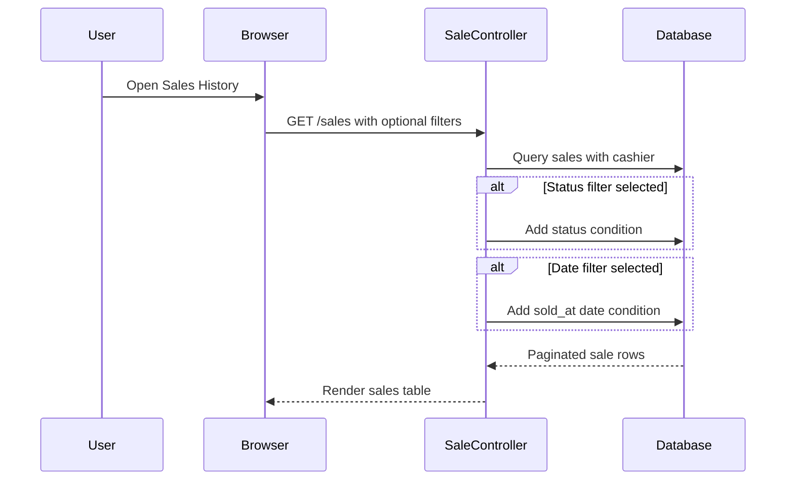
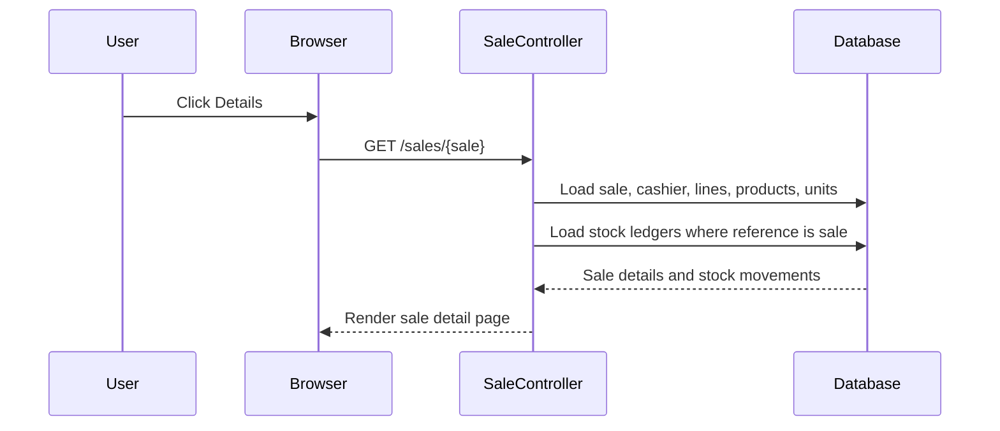
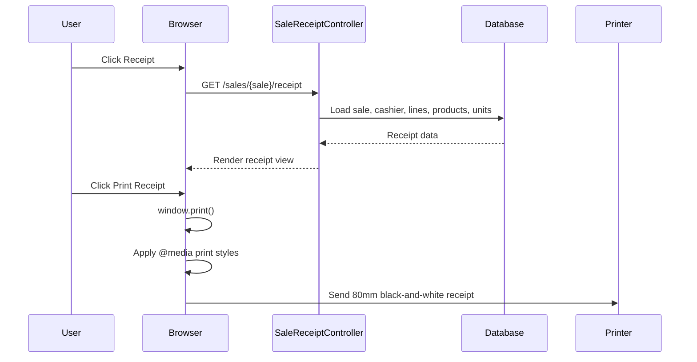

# Phase 2, Epic 4 - Receipts Sequence

## Purpose

This document explains how sales history, sale detail, and receipt printing work. Use it to manually verify list filtering, receipt display, and 80mm POS print behavior before approving Phase 2, Epic 4.

## Sales History Sequence

## Sale Detail Sequence

## Receipt Print Sequence

## Manual Test 1 - Sales List Basic Display

1. Log in as an admin, pharmacist, or cashier.
2. Complete at least one POS sale.
3. Open `/sales`.
4. Verify the table shows:
   - Sale number.
   - Sold date/time.
   - Cashier.
   - Patient value or `No patient`.
   - Total.
   - Status.
   - Details action.
   - Receipt action.

## Manual Test 2 - Status Filter

1. Ensure there are sales with statuses such as `completed`, `held`, or `voided`.
2. Open `/sales`.
3. Select a status in the filter.
4. Click Filter.
5. Verify only sales matching that status appear.
6. Clear the status filter.
7. Verify all sales appear again.

## Manual Test 3 - Date Filter

1. Ensure completed sales exist on known dates.
2. Open `/sales`.
3. Choose a sold date.
4. Click Filter.
5. Verify only sales with `sold_at` on that date appear.

## Manual Test 4 - Sale Detail Page

1. Open `/sales`.
2. Click Details for a completed sale.
3. Verify sale header shows sale number, status, and date/time.
4. Verify Sale Lines table shows:
   - Product.
   - Unit.
   - Quantity.
   - Unit price.
   - Discount.
   - Tax.
   - Line total.
5. Verify Payment Summary shows:
   - Subtotal.
   - Discount.
   - Tax.
   - Grand total.
   - Payment method.
   - Amount paid.
   - Change.
6. Verify Stock Movements show ledger rows linked to this sale.

## Manual Test 5 - Receipt View

1. Open `/sales`.
2. Click Receipt for a completed sale.
3. Verify the receipt shows:
   - Clinic logo and clinic name.
   - Sale number.
   - Date/time.
   - Cashier.
   - Patient value or `No patient`.
   - Item rows.
   - Subtotal, discount, tax, grand total.
   - Payment method, amount paid, and change.
   - Footer thank-you message.

## Manual Test 6 - 80mm Print Behavior

1. Open a receipt page.
2. Click `Print Receipt`.
3. In the browser print preview, verify:
   - Sidebar navigation is hidden.
   - Top header is hidden.
   - Back/Print buttons are hidden.
   - Receipt uses black text on white background.
   - Brand color backgrounds and shadows are removed.
   - Receipt width is formatted for `80mm`.
   - Page margins are removed or minimal.
4. Print to a PDF or thermal printer and confirm the layout is readable.

## Manual Test 7 - Authorization

1. Log in as a stock manager.
2. Try to open `/sales`.
3. Try to open `/sales/{sale}`.
4. Try to open `/sales/{sale}/receipt`.
5. Verify all three are forbidden.

## Notes

- Sale void is not implemented in Epic 4.
- Receipt printing uses browser print and CSS `@media print`.
- Cashier, pharmacist, and admin can access the sales history and receipt routes in this Epic.
