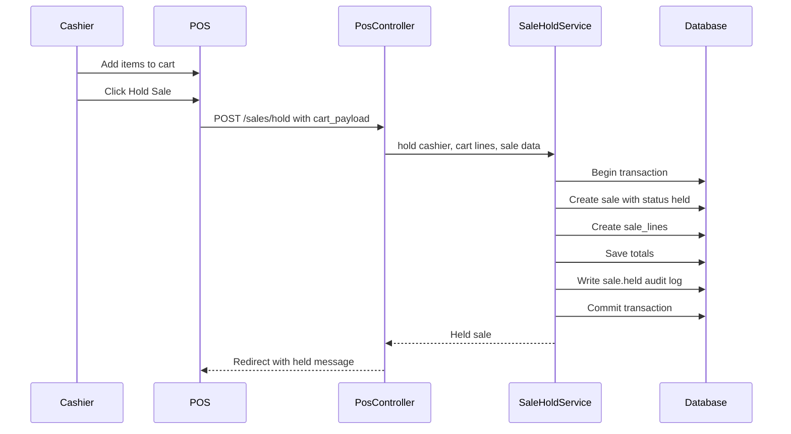
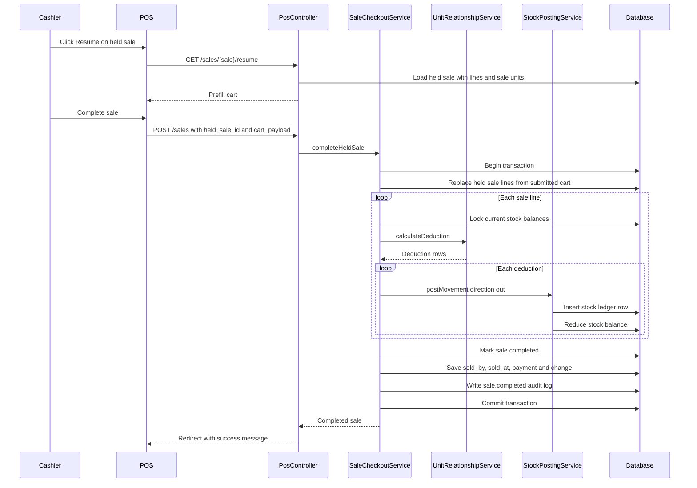

# Phase 2, Epic 5 - Hold Resume Sequence

## Purpose

This document explains how POS Hold and Resume works. Use it to manually verify that held sales save cart data without posting stock ledger rows or reducing stock balances, and that inventory is checked only when the held sale is completed.

## Hold Sale Sequence

## Resume And Complete Sequence

## Manual Test 1 - Hold Does Not Deduct Inventory

1. Log in as a cashier.
2. Confirm a product has an existing stock balance, for example `10 strip`.
3. Open POS.
4. Add that product to the cart.
5. Click `Hold Sale`.
6. Verify a new `sales` row exists with `status = held`.
7. Verify matching `sale_lines` rows exist.
8. Verify no `stock_ledgers` rows were created for the held sale.
9. Verify `stock_balances.quantity` did not change.

## Manual Test 2 - Resume Held Sale

1. Open `/sales`.
2. Find the held sale.
3. Click `Resume`.
4. Verify POS opens with a banner such as `Resuming held sale S-...`.
5. Verify the cart is prefilled with the held sale lines.
6. Verify discount, tax, and payment method values are restored where available.

## Manual Test 3 - Complete Resumed Sale

1. Resume a held sale.
2. Confirm stock is available now.
3. Enter amount paid.
4. Click `Complete Sale`.
5. Verify the existing held `sales` row changes to `completed`.
6. Verify `sold_by` and `sold_at` are saved.
7. Verify `stock_ledgers` rows are created with `type = sale` and `direction = out`.
8. Verify `stock_balances.quantity` is reduced only after completion.

## Manual Test 4 - Stock Checked At Completion Time

1. Hold a sale for a product without enough current stock.
2. Verify the sale can still be held.
3. Resume the held sale.
4. Try to complete it while stock is still insufficient.
5. Verify checkout fails with an error.
6. Verify the sale remains `held`.
7. Verify no `stock_ledgers` rows were created.
8. Verify `stock_balances.quantity` did not change.
9. Add enough stock.
10. Resume and complete again.
11. Verify stock is deducted successfully.

## Manual Test 5 - Re-Hold A Resumed Sale

1. Resume a held sale.
2. Change quantity or unit.
3. Click `Hold Sale` again.
4. Verify the same held sale is updated, not completed.
5. Verify old held sale lines are replaced by the current cart lines.
6. Verify no stock ledger rows are created.
7. Verify stock balances remain unchanged.

## Database Records To Verify

For held sales:

- `sales.status = held`
- `sales.sold_at` remains null.
- `sale_lines` preserve product, unit, quantity, and price.
- No `stock_ledgers` rows reference the held sale.
- No stock balance quantity changes.

For completed resumed sales:

- `sales.status = completed`
- `sales.sold_by` is the cashier user ID.
- `sales.sold_at` is not null.
- `stock_ledgers.reference_type = App\Models\Sale`
- `stock_ledgers.reference_id` points to the sale.
- `stock_ledgers.direction = out`
- `stock_balances.quantity` is reduced.

## Notes

- Holding a sale is not stock reservation.
- Stock can change while a sale is held.
- Checkout must always recalculate availability at completion time.
- Sale void is not part of Epic 5.
