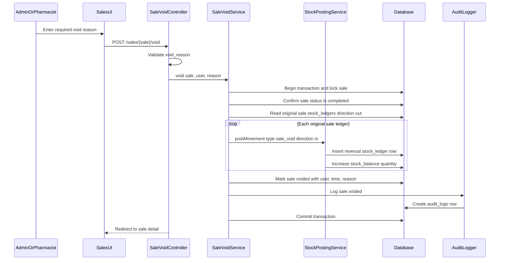

# Phase 2, Epic 6 - Sale Void Sequence

## Purpose

This document explains how authorized users void completed sales and how the system restores stock through immutable reversal ledger entries.

## Sale Void Sequence

## Authorization Rules

- Admin can void completed sales.
- Pharmacist can void completed sales.
- Cashier cannot void sales.
- Stock Manager cannot access sales void routes.

## Manual Test 1 - Admin Voids Completed Sale

1. Log in as an admin.
2. Complete a POS sale with stock deduction.
3. Open Sales History.
4. Confirm the completed sale shows a void action.
5. Enter a void reason.
6. Submit void.
7. Verify the sale detail page shows the sale as `voided`.
8. Verify `Voided By`, `Voided At`, and `Void Reason` are visible.

## Manual Test 2 - Pharmacist Voids Completed Sale

1. Log in as a pharmacist.
2. Open a completed sale.
3. Enter a void reason.
4. Submit void.
5. Verify the sale status changes to `voided`.

## Manual Test 3 - Cashier Cannot Void

1. Log in as a cashier.
2. Open Sales History.
3. Verify the cashier can see sale details and receipts.
4. Verify no void form or void button is shown.
5. Try posting directly to `/sales/{sale}/void`.
6. Verify the response is forbidden.
7. Verify sale status remains `completed`.

## Manual Test 4 - Void Reason Required

1. Log in as admin or pharmacist.
2. Open a completed sale.
3. Submit the void form without a reason.
4. Verify validation fails.
5. Verify sale status remains `completed`.
6. Verify no `sale_void` ledger rows are created.

## Manual Test 5 - Stock Reversal Ledger Verification

1. Before void, record original `stock_ledgers` rows for the sale:
   - `reference_type = App\Models\Sale`
   - `reference_id = sale ID`
   - `type = sale`
   - `direction = out`
2. Record related `stock_balances.quantity` values.
3. Void the sale with a reason.
4. Verify every original sale ledger still exists unchanged.
5. Verify matching reversal rows exist:
   - same product.
   - same stock batch.
   - same product unit.
   - same quantity.
   - `type = sale_void`.
   - `direction = in`.
   - same sale reference.
6. Verify `stock_balances.quantity` increased by the reversal quantity.

## Manual Test 6 - Double Void Rejected

1. Void a completed sale successfully.
2. Try to void the same sale again.
3. Verify the system rejects the second void.
4. Verify only one set of `sale_void` ledger rows exists.
5. Verify stock balance is restored only once.

## Database Records To Verify

For the voided sale:

- `sales.status = voided`
- `sales.voided_by` is the admin or pharmacist user ID.
- `sales.voided_at` is not null.
- `sales.void_reason` stores the entered reason.

For stock movement:

- Original `stock_ledgers.type = sale` rows remain unchanged.
- Original `stock_ledgers.direction = out` rows remain unchanged.
- New `stock_ledgers.type = sale_void` rows are created.
- New `stock_ledgers.direction = in` rows point to the same sale.
- `stock_balances.quantity` is increased by the reversal quantity.

For audit:

- `audit_logs.action = sale.voided`
- `audit_logs.auditable_type = App\Models\Sale`
- `audit_logs.auditable_id` is the voided sale ID.
