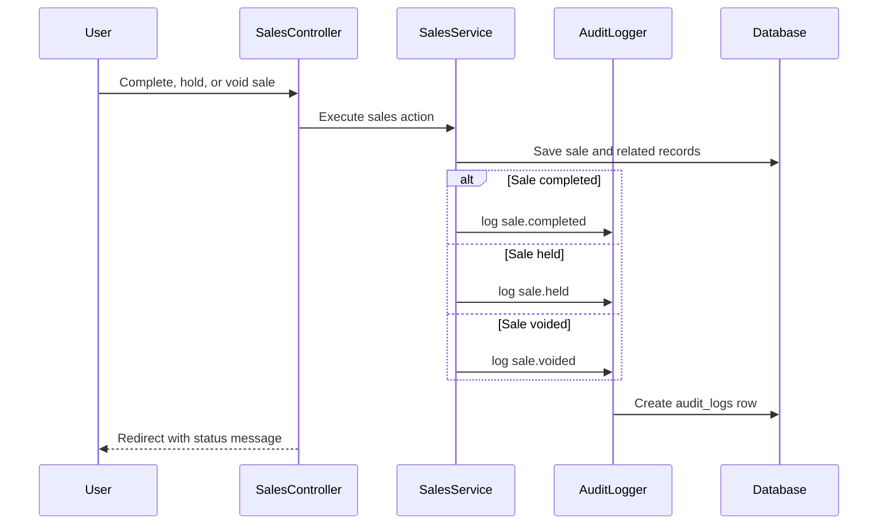
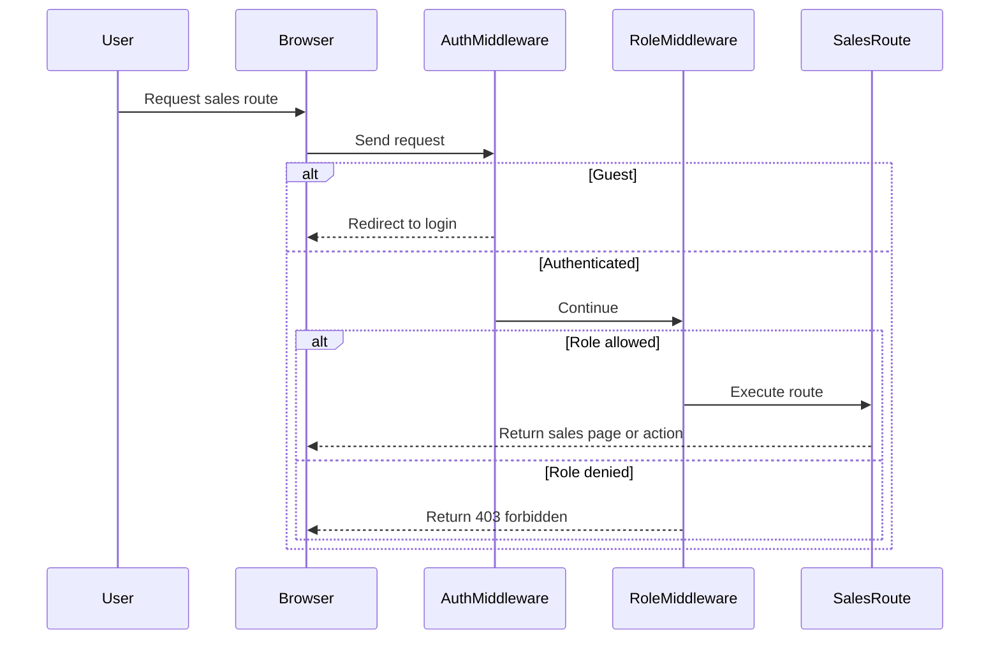

# Phase 2, Epic 7 & 8 - Audit, QA And Documentation Sequence

## Purpose

This document explains how to verify sales audit logging, authorization, seeded QA data, and final Phase 2 documentation.

## Audit Logging Sequence

## Authorization Sequence

## Manual Test 1 - Guest Cannot Access POS

1. Log out.
2. Open `/sales/pos`.
3. Verify the app redirects to `/login`.
4. Verify no POS UI is visible.

## Manual Test 2 - Cashier Can Complete Sale

1. Log in as `cashier@zarliminnew.test`.
2. Open POS.
3. Add an in-stock product.
4. Enter enough amount paid.
5. Complete the sale.
6. Verify the sale is completed.
7. Verify stock is deducted.
8. Verify `audit_logs.action = sale.completed`.

## Manual Test 3 - Sale Hold Is Audited

1. Log in as cashier.
2. Add a product to the POS cart.
3. Click `Hold Sale`.
4. Verify the sale is `held`.
5. Verify stock balance does not change.
6. Verify `audit_logs.action = sale.held`.

## Manual Test 4 - Cashier Cannot Void

1. Log in as cashier.
2. Open a completed sale.
3. Verify no void form is shown.
4. Try to submit `POST /sales/{sale}/void` directly.
5. Verify the response is forbidden.
6. Verify sale status remains `completed`.
7. Verify no `sale_void` ledger rows are created.

## Manual Test 5 - Admin Can Void

1. Log in as `admin@zarliminnew.test`.
2. Open a completed sale.
3. Enter a void reason.
4. Submit void.
5. Verify sale status becomes `voided`.
6. Verify `sale_void` ledger rows are created with `direction = in`.
7. Verify original `sale` ledger rows remain unchanged.
8. Verify `audit_logs.action = sale.voided`.

## Manual Test 6 - Seeded QA Data

1. Run migrations and seeders.
2. Confirm these seeded users exist:
   - `admin@zarliminnew.test`
   - `pharmacist@zarliminnew.test`
   - `cashier@zarliminnew.test`
3. Confirm POS test products exist, such as `PARA-500` and `AMOX-500`.
4. Confirm sale-enabled units exist for those products.
5. Confirm `stock_balances` rows exist for POS testing.

## Database Checks

For audit logs:

- `audit_logs.user_id` matches the acting user.
- `audit_logs.action` is one of `sale.completed`, `sale.held`, or `sale.voided`.
- `audit_logs.auditable_type = App\Models\Sale`.
- `audit_logs.auditable_id` points to the sale.
- `audit_logs.created_at` records when the action happened.

For authorization:

- Guest POS request redirects to login.
- Cashier can post checkout.
- Cashier receives forbidden response on sale void.
- Admin can post sale void.

For QA docs:

- `docs/phase-2-usage-notes.md` explains POS sales, optional patient selection, and sale voids.
- This flow document starts with the exact Phase and Epic label.
