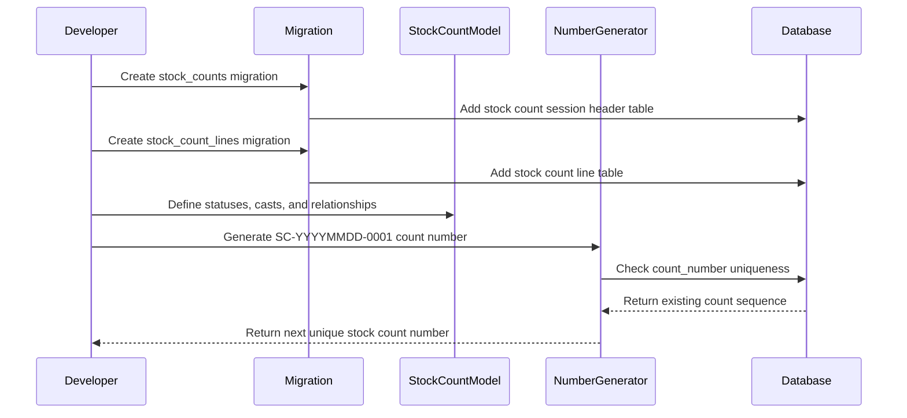

# Phase 3, Epic 1 - Stock Control Foundation

## Purpose

This document explains the Phase 3 stock control foundation: stock count tables, stock count models, and the server-side count number generator.

## Sequence Flow

## Manual QA

1. Run migrations.
2. Confirm the `stock_counts` table exists.
3. Confirm the `stock_count_lines` table exists.
4. Confirm each table has its own dedicated migration file.
5. Create a stock count session with `status = draft`.
6. Create a stock count line with product, product unit, optional batch, expected quantity, counted quantity, and variance quantity.
7. Confirm `StockCount` has many `StockCountLine` records.
8. Confirm `StockCount` belongs to counted user and reviewed user.
9. Confirm `StockCountLine` belongs to product, product unit, optional stock batch, and optional adjustment ledger.
10. Generate a count number and confirm it uses `SC-YYYYMMDD-0001` format.
11. Generate another count number for the same date after saving the first one and confirm the sequence increments.

## Database Checks

- Check `stock_counts.count_number` is unique.
- Check `stock_counts.status` defaults to `draft`.
- Check `stock_counts.counted_by` and `stock_counts.reviewed_by` reference `users` and use `nullOnDelete`.
- Check `stock_count_lines.stock_count_id` cascades on delete.
- Check `stock_count_lines.product_id` and `stock_count_lines.product_unit_id` use restricted deletes.
- Check `stock_count_lines.stock_batch_id` is nullable for non-batch-tracked products.
- Check `stock_count_lines.expected_quantity`, `counted_quantity`, and `variance_quantity` use `18,6` decimal precision.
- Check `stock_count_lines.adjustment_ledger_id` is nullable and references `stock_ledgers`.

## Service Checks

- Confirm count numbers are generated server-side by `StockCountNumberGenerator`.
- Confirm saved count numbers remain unique per database constraint.
- Confirm Epic 1 setup does not create stock ledger rows.
- Confirm Epic 1 setup does not mutate stock balances.
