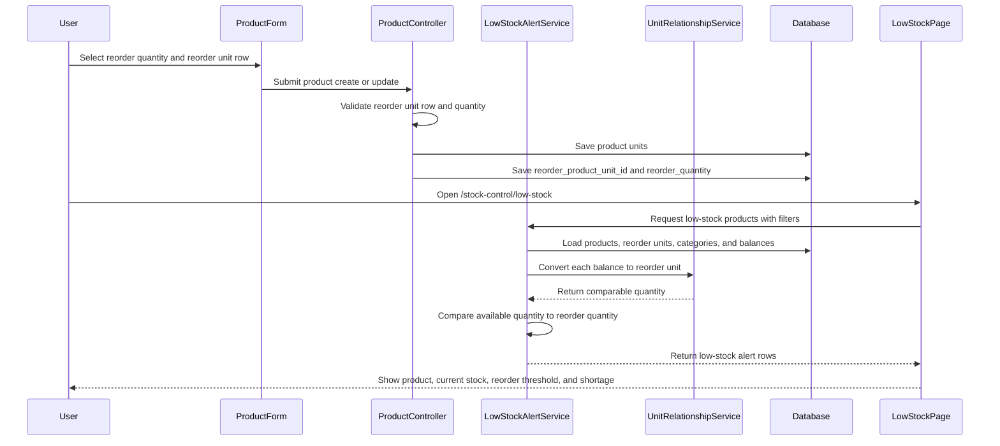

# Phase 3, Epic 2 - Low-Stock Alerts

## Purpose

This document explains the low-stock alert flow: configuring product reorder settings, comparing stock across related units, and showing authorized users the low-stock alert page.

## Sequence Flow

## Manual QA

1. Log in as an admin, stock manager, or pharmacist.
2. Create or edit a product with at least two related units, such as Box and Strip.
3. Set `Reorder Quantity` to `20`.
4. Set `Reorder Unit` to the Strip row.
5. Save the product.
6. Confirm the product saves successfully.
7. Add stock below the threshold, such as `1 Box` and `5 Strips` when `1 Box = 10 Strips`.
8. Open `/stock-control/low-stock`.
9. Confirm the product appears with available stock converted to `15 strip`.
10. Confirm shortage shows `5 strip`.
11. Increase stock above the threshold.
12. Refresh the low-stock page and confirm the product no longer appears.
13. Test product search, category filter, and active status filter.
14. Log in as a cashier and confirm the low-stock page is forbidden.

## Database Checks

- Check `products.reorder_product_unit_id` stores the selected product unit ID.
- Check `products.reorder_quantity` stores a positive quantity.
- Check the selected reorder unit belongs to the same product.
- Check no stock ledger rows are created by viewing low-stock alerts.
- Check no stock balances are mutated by viewing low-stock alerts.

## Service Checks

- Confirm `LowStockAlertService` uses only products with reorder configuration.
- Confirm same-unit balances compare directly in the reorder unit.
- Confirm related-unit balances are converted through `UnitRelationshipService`.
- Confirm raw quantities from different units are never compared directly.
- Confirm products at or above threshold are excluded.
- Confirm returned alert rows include product, reorder unit, reorder quantity, available quantity, formatted stock, and shortage.
