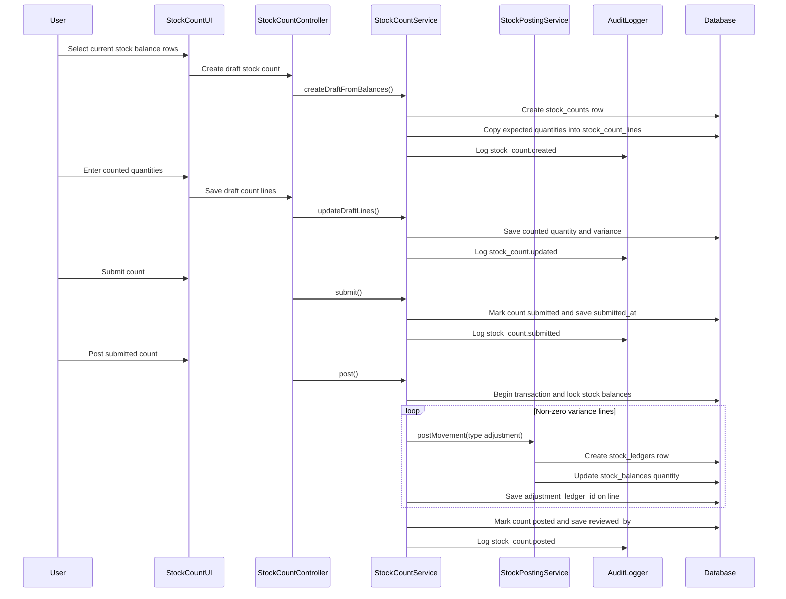

# Phase 3, Epic 3 - Stock Count And Variance Adjustment

## Purpose

This document explains the stock count workflow: creating a draft count from current stock balances, entering physical counted quantities, submitting for review, and posting variance adjustments through immutable stock ledger rows.

## Sequence Flow

## Manual QA

1. Log in as a stock manager or admin.
2. Confirm at least one product has an existing stock balance.
3. Open `/stock-counts`.
4. Create a new stock count.
5. Select one or more current stock balance rows.
6. Confirm the draft stock count is created with `status = draft`.
7. Confirm each line copied the current stock balance quantity into `expected_quantity`.
8. Change a counted quantity below expected and save.
9. Confirm variance is negative.
10. Change another counted quantity above expected and save.
11. Confirm variance is positive.
12. Submit the count.
13. Confirm the count becomes read-only and `submitted_at` is saved.
14. Post the count as admin or stock manager.
15. Confirm the count status becomes `posted`.
16. Confirm `reviewed_by` and `posted_at` are saved.
17. Confirm each non-zero variance line stores `adjustment_ledger_id`.
18. Try editing the posted count and confirm it is rejected.
19. Log in as a cashier and confirm stock count pages are forbidden.
20. Log in as a pharmacist and confirm they can participate in counts but cannot post adjustments.

## Database Checks

- Check `stock_counts.status` changes from `draft` to `submitted` to `posted`.
- Check `stock_counts.counted_by` is set when the draft is created.
- Check `stock_counts.reviewed_by` is set when the count is posted.
- Check `stock_count_lines.expected_quantity` does not change after line creation.
- Check `stock_count_lines.counted_quantity` and `variance_quantity` update only while draft.
- Check `stock_count_lines.adjustment_ledger_id` is set for non-zero posted variance lines.
- Check audit logs exist for `stock_count.created`, `stock_count.updated`, `stock_count.submitted`, and `stock_count.posted`.

## Stock Balance And Ledger Checks

- Positive variance creates `stock_ledgers.type = adjustment` with `direction = in`.
- Negative variance creates `stock_ledgers.type = adjustment` with `direction = out`.
- Adjustment ledger rows reference `StockCount::class` and the stock count ID.
- Stock balances are updated only through `StockPostingService`.
- Posted stock count lines remain traceable to their adjustment ledger rows.
- Zero variance lines do not create stock ledger rows.
