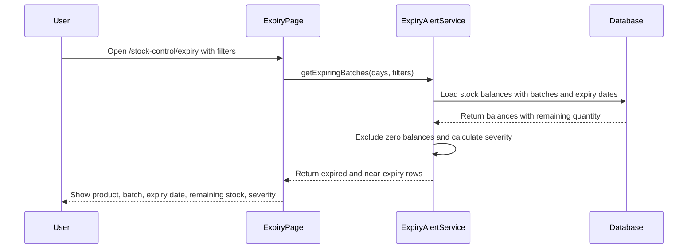
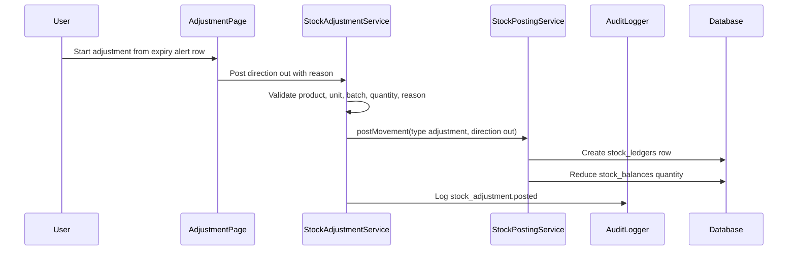
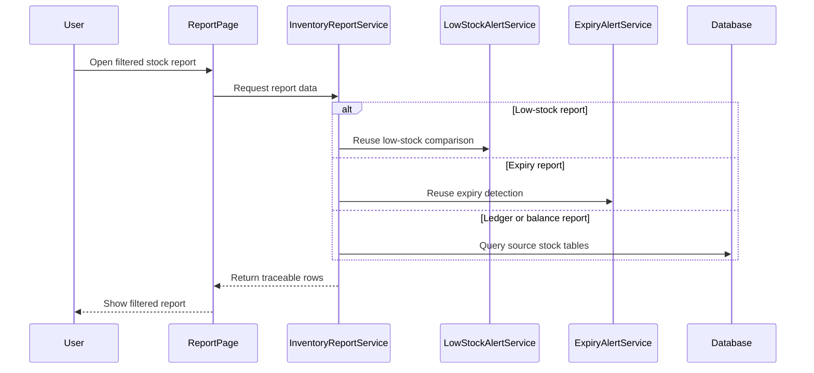

# Phase 3, Epics 4, 5, and 6 - Final Phase 3 Push

## Purpose

This document explains the final Phase 3 stock control flows: expiry tracking, expired stock adjustment, core stock reports, audit logging, authorization, and verification.

## Expiry Sequence Flow

## Expired Stock Adjustment Flow

## Report Flow

## Manual QA

1. Open `/stock-control/expiry` as admin, stock manager, or pharmacist.
2. Confirm expired batches with remaining stock appear.
3. Confirm zero-stock batches do not appear.
4. Filter by product, category, expired-only, and 30/60/90 day windows.
5. Start adjustment from an expired batch.
6. Confirm product, batch, unit, and remaining stock are pre-filled.
7. Enter a quantity and reason.
8. Post the adjustment.
9. Confirm stock balance decreases.
10. Confirm `stock_ledgers.type = adjustment` and `direction = out`.
11. Confirm `stock_adjustment.posted` audit log exists.
12. Review `/reports/stock-on-hand` and test product/category/batch/status filters.
13. Review `/reports/stock-movements` and test date/product/type/direction filters.
14. Review `/reports/low-stock` and confirm it matches low-stock alerts.
15. Review `/reports/expiry` and confirm it matches expiry alerts.
16. Review `/reports/stock-adjustments` and confirm stock count adjustments link back to stock counts.
17. Confirm guests redirect to login.
18. Confirm cashiers cannot access stock control and report routes.

## Database Checks

- Expiry alerts read from `stock_batches` and `stock_balances`.
- Expiry alerts ignore balances with `quantity = 0`.
- Expired stock removal never deletes stock batches.
- Expired stock removal posts an immutable stock ledger row.
- Manual adjustments require a reason.
- Stock count cancellation creates `stock_count.cancelled` audit logs.
- Reports do not create or mutate stock rows.

## Verification Checklist

- Laravel Pint passes.
- Focused final Phase 3 tests pass.
- Full Laravel test suite passes.
- Frontend build passes.
- IDE lints show no introduced errors.
