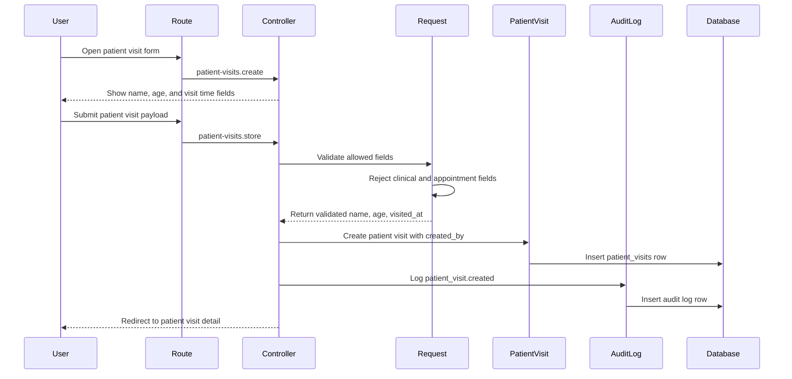

# Phase 4, Epic 1 - Patient Visit Foundation

## Purpose

This document explains the Phase 4 patient visit foundation: ultra-minimal patient visit storage, validation, screens, audit logging, and QA checks.

Patient visit records are for service fee reference only. They must store only patient name, age, and visit datetime as business fields.

## Sequence Flow

## Manual QA

1. Run migrations.
2. Confirm the `patient_visits` table exists.
3. Confirm the table has its own dedicated migration file.
4. Confirm the table stores `patient_name`, `age`, `visited_at`, `created_by`, and timestamps.
5. Log in as an allowed user such as Admin, Pharmacist, or Cashier.
6. Open `/patient-visits`.
7. Create a patient visit with patient name, age, and visit time.
8. Confirm the created visit appears in the list.
9. Open the patient visit detail page.
10. Confirm only patient name, age, visit time, and created user are displayed.
11. Edit patient name, age, or visit time.
12. Confirm the update is saved.
13. Use the list filters by patient name and visit date range.
14. Log in as Stock Manager and confirm patient visit pages are forbidden.
15. Log out and confirm guest users are redirected to login.

## Forbidden Field QA

Submit patient visit create or update requests with these fields and confirm validation fails:

- `diagnosis`
- `symptoms`
- `vitals`
- `prescription`
- `clinical_notes`
- `medical_history`
- `doctor_id`
- `appointment_at`
- `appointment_status`
- `queue_number`

Confirm no `patient_visits` row is created when forbidden fields are submitted.

## Database Checks

- Check `patient_visits.patient_name` is present.
- Check `patient_visits.age` is present.
- Check `patient_visits.visited_at` is present.
- Check `patient_visits.created_by` references `users` and uses `nullOnDelete`.
- Confirm the table does not contain diagnosis, prescription, vitals, notes, doctor, queue, or appointment columns.
- Confirm create and update actions write rows to `audit_logs`.

## Service And Boundary Checks

- Confirm patient visit create and update do not call stock services.
- Confirm patient visit create and update do not create stock ledger rows.
- Confirm patient visit create and update do not update stock balances.
- Confirm pharmacy POS still works without patient visit records.
- Confirm the UI contains no EHR, diagnosis, prescription, vitals, doctor, queue, or appointment fields.
