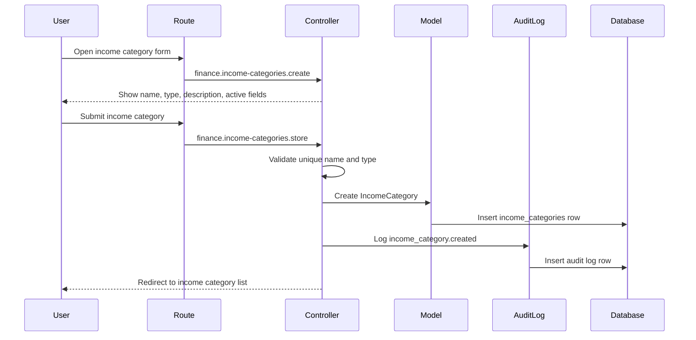

# Phase 4, Epic 2 - Finance Categories

## Purpose

This document explains the Phase 4 finance category foundation: income categories, expense categories, category management screens, dedicated seeders, and QA checks.

Epic 2 covers category setup only. Income entries, expense entries, and finance reports belong to later epics.

## Sequence Flow

## Manual QA

1. Run migrations.
2. Confirm `income_categories` and `expense_categories` tables exist.
3. Confirm each table has its own dedicated migration file.
4. Run `php artisan db:seed --class=IncomeCategorySeeder`.
5. Run `php artisan db:seed --class=ExpenseCategorySeeder`.
6. Log in as Admin or Pharmacist.
7. Open `/finance/income-categories`.
8. Create an income category with type `service`.
9. Create an income category with type `general`.
10. Confirm duplicate names are rejected.
11. Edit a category and set it to inactive.
12. Open `/finance/expense-categories`.
13. Create and edit an expense category.
14. Confirm inactive categories still appear in the list with an Inactive badge.
15. Log in as Stock Manager and confirm finance category pages are forbidden.
16. Log out and confirm guest users are redirected to login.

## Database Checks

- Check `income_categories.name` is unique.
- Check `income_categories.type` is `service` or `general`.
- Check `income_categories.is_active` defaults to true.
- Check `expense_categories.name` is unique.
- Check `expense_categories.is_active` defaults to true.
- Confirm create and update actions write rows to `audit_logs`.
- Confirm seeders create default categories without editing `DatabaseSeeder.php` data directly.

## Service And Boundary Checks

- Confirm `IncomeCategory::active()` returns only active income categories.
- Confirm `ExpenseCategory::active()` returns only active expense categories.
- Confirm Epic 2 does not create income or expense entry tables.
- Confirm Epic 2 does not affect stock ledger or pharmacy sales.
- Confirm inactive categories remain visible for history but will be excluded from new entry forms in Epic 3 and Epic 4.
