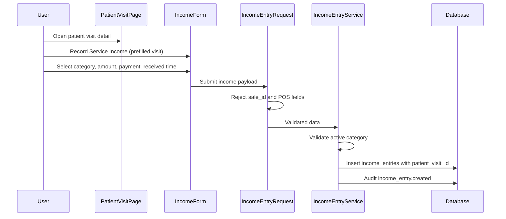
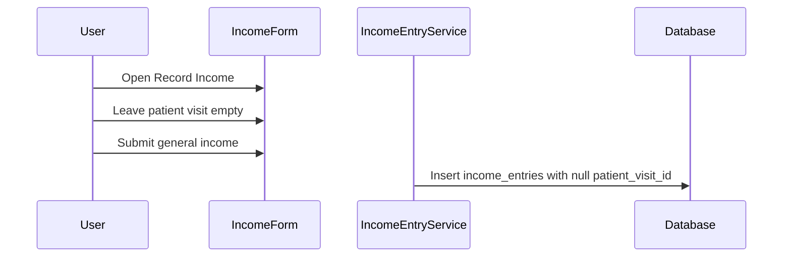
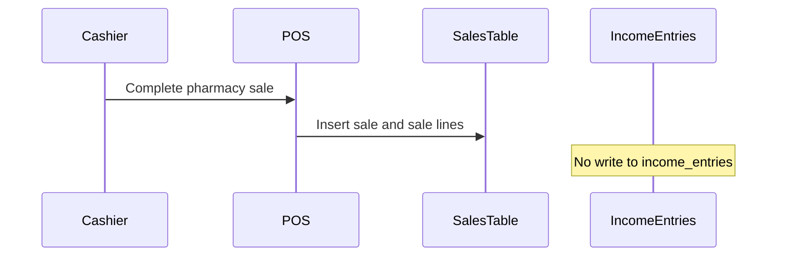

# Phase 4, Epic 3 - Income Tracking

## Purpose

This document explains income entry recording for service and general clinic income, optional patient visit linking, and the strict separation from pharmacy POS sales.

## Sequence Flow

### Income with patient visit

### Income without patient visit

### Pharmacy sale boundary

## Manual QA

1. Run migrations and seed income categories if needed.
2. Log in as Cashier, Pharmacist, or Admin.
3. Open `/finance/income` and confirm the page explains pharmacy sales are separate.
4. Record income **with** a patient visit selected.
5. Confirm the list shows category, amount, patient name, age, and visit time only.
6. Record income **without** a patient visit.
7. Open a patient visit and click **Record Service Income**.
8. Confirm the patient visit is prefilled on the form.
9. Save only after entering category, amount, payment method, and received time.
10. Confirm linked income appears on the patient visit detail page.
11. Try submitting `sale_id` or `sale_number` in the form (e.g. via dev tools) and confirm validation fails.
12. Complete a pharmacy POS sale and confirm **no** row is added to `income_entries`.
13. Set an income category to inactive and confirm it cannot be used for a new entry.
14. Filter income by date range, category, payment method, patient visit, and user.
15. Confirm Stock Manager cannot access income routes.

## Database Checks

- `income_entries` has `income_category_id`, nullable `patient_visit_id`, `amount`, `payment_method`, `received_at`, `received_by`, `description`.
- Confirm **no** `sale_id` or `sale_number` column exists on `income_entries`.
- `patient_visit_id` is null when income is recorded without a patient.
- `received_by` references the collecting user.
- Audit logs exist for `income_entry.created` and `income_entry.updated`.

## Boundary Checks

- Pharmacy sales remain in `sales` only.
- Income entry create/update does not call stock or POS checkout services.
- Patient visit selector shows only name, age, and visit datetime.
- No clinical, EHR, or appointment fields appear on income screens.
- Finance summary report is out of scope for Epic 3.
