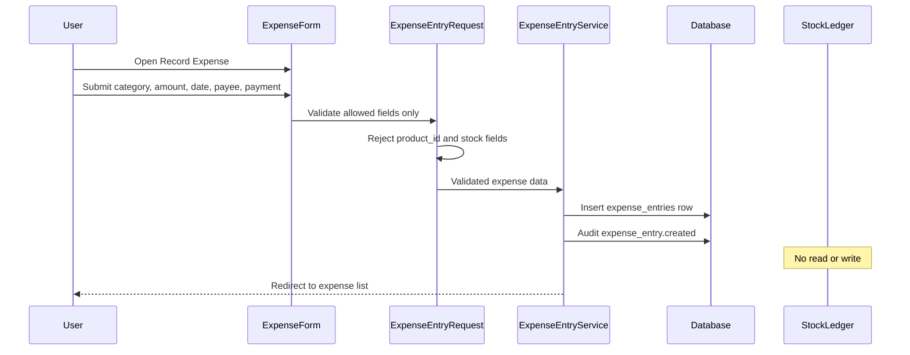

# Phase 4, Epic 4 - Expense Tracking

## Purpose

This document explains expense entry recording for clinic and pharmacy operating costs, and confirms expenses remain fully decoupled from inventory, products, and stock ledger systems.

## Sequence Flow

## Manual QA

1. Run migrations and seed expense categories if needed.
2. Log in as Cashier, Pharmacist, or Admin.
3. Open `/finance/expenses` and confirm the page states expenses do not affect inventory or stock.
4. Record an expense with category, amount, expense date, payment method, and optional payee/description.
5. Confirm the expense appears in the list with correct category and amount.
6. Edit the expense and confirm changes are saved and audited.
7. Filter by date range, category, payment method, payee, and created user.
8. Set an expense category to inactive and confirm it cannot be used for a new entry.
9. Try submitting `product_id` or `stock_balance_id` via dev tools and confirm validation fails.
10. Note current `stock_ledgers` and `stock_balances` row counts (or quantities).
11. Record a new expense.
12. Confirm stock ledger and stock balance data are unchanged.
13. Confirm Stock Manager cannot access expense routes.
14. Confirm guest users are redirected to login.

## Database Checks

- `expense_entries` has `expense_category_id`, `amount`, `expense_date`, `payee`, `payment_method`, `description`, `created_by`.
- Confirm **no** `product_id`, `stock_balance_id`, `stock_ledger_id`, `purchase_receipt_id`, or `sale_id` columns.
- `created_by` references the user who recorded the expense.
- Audit logs exist for `expense_entry.created` and `expense_entry.updated`.

## Boundary Checks

- Expense create/update does not call stock posting, stock adjustment, or stock count services.
- No new `stock_ledgers` rows are created when an expense is recorded.
- No `stock_balances` quantities change when an expense is recorded.
- Expense screens contain no product, unit, batch, or supplier inventory fields.
- Finance summary report is out of scope for Epic 4.
