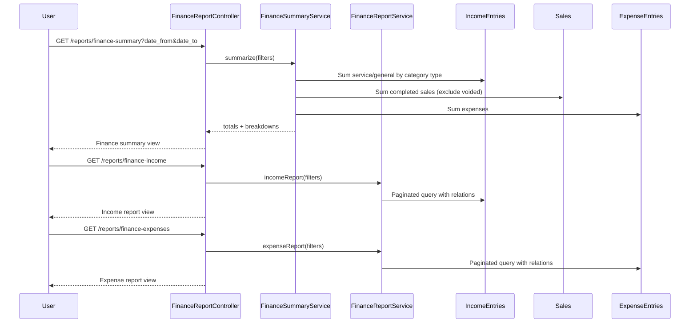

# Phase 4, Epic 5 - Finance Reports

## Purpose

This document explains finance reporting: income and expense list reports plus a finance summary that combines service income, general income, pharmacy POS sales (read-only from `sales`), and expenses into a net balance. Pharmacy sales are never copied into `income_entries`.

## Sequence Flow

## Manual QA

1. Run migrations and seed income/expense categories if needed.
2. Log in as Pharmacist or Admin.
3. Open `/reports/finance-summary` (or use **Finance Summary** in the sidebar).
4. Confirm the page explains pharmacy POS sales are read separately and not duplicated into income entries.
5. Set date range to the current month and note default filters apply when dates are empty.
6. Record a **service** income entry (e.g. Consultation Fee) for today.
7. Record a **general** income entry (e.g. Other Income) for today.
8. Complete a pharmacy POS sale for today (Cashier/Pharmacist).
9. Record an expense for today.
10. Refresh finance summary and confirm:
    - Service income total matches service entries only.
    - General income total matches general entries only.
    - Pharmacy sales total matches completed POS `grand_total` for the range.
    - Expense total matches expense entries.
    - Net balance = service + general + pharmacy sales − expenses.
11. Void a completed sale and refresh summary; confirm voided amount is **not** included in pharmacy sales.
12. Confirm `income_entries` row count did **not** increase when the POS sale was completed.
13. Log in as Cashier and open **Income Report** and **Expense Report**; confirm filters and pagination work.
14. As Cashier, try `/reports/finance-summary` and confirm access is denied (403).
15. Log in as Stock Manager and confirm all finance report routes return forbidden.
16. Log out and confirm guest users are redirected to login.

## Income Report QA

1. Log in as Cashier, Pharmacist, or Admin.
2. Open `/reports/finance-income`.
3. Confirm columns: received date, category, type, patient visit (name, age, visit datetime only), amount, payment method, user.
4. Filter by date range, category, payment method, patient visit, and received-by user.
5. Confirm pharmacy POS sales do **not** appear on this report.

## Expense Report QA

1. Open `/reports/finance-expenses`.
2. Confirm columns: expense date, category, amount, payee, payment method, created-by user.
3. Filter by date range, category, payment method, payee (partial match), and created-by user.

## Database Checks

- Finance summary reads `income_entries` joined to `income_categories.type` for service vs general splits.
- Pharmacy total uses `sales` where `status = completed` only; voided and held sales are excluded.
- No `sale_id` or pharmacy columns exist on `income_entries`.
- Completing a POS sale does not insert into `income_entries`.
- Expense totals come from `expense_entries` only; no stock tables are queried.

## Boundary Checks

- Finance summary does not write to `income_entries` when displaying pharmacy sales.
- Income report shows only manual income entries, not POS sales.
- Patient visit display on income report includes only name, age, and visit datetime (no clinical fields).
- Stock Manager cannot access finance reports.
- Cashier cannot access finance summary; can access income and expense reports.
