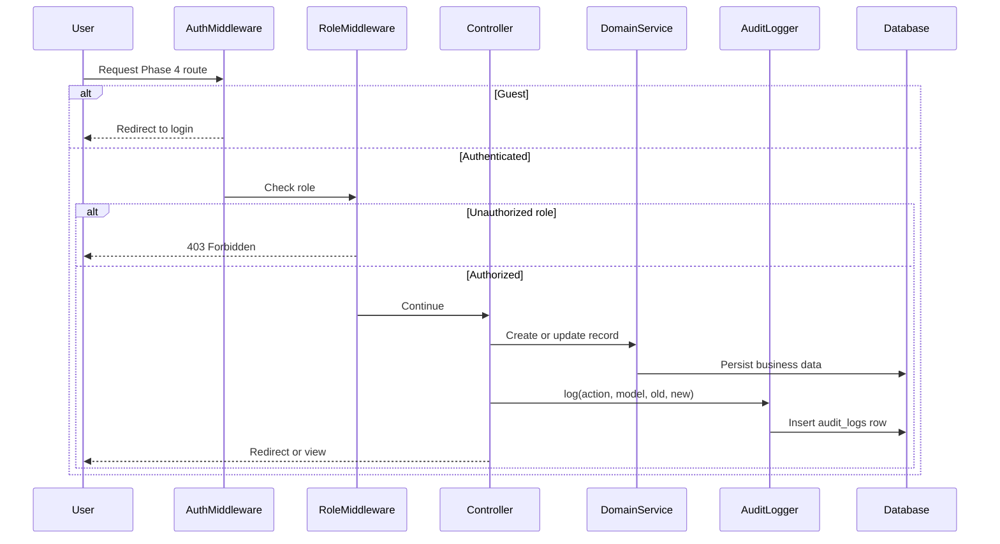

# Phase 4, Epic 6 - Audit, Security, And Documentation

## Purpose

This document confirms Phase 4 audit logging, role-based access control, usage documentation, and final verification. It ties together patient visits, finance categories, income/expense entries, and finance reports under one security and audit boundary.

## Sequence Flow



## Manual QA - Audit Logs

1. Run migrations and seed income/expense categories.
2. Log in as Cashier.
3. Create a patient visit; confirm `audit_logs.action = patient_visit.created`.
4. Update the visit name; confirm `patient_visit.updated` with `old_values` and `new_values` for allowed fields only.
5. Log in as Admin.
6. Create or update an income category; confirm `income_category.created` or `income_category.updated`.
7. Create or update an expense category; confirm `expense_category.created` or `expense_category.updated`.
8. Log in as Cashier.
9. Create an income entry; confirm `income_entry.created`.
10. Edit the income amount; confirm `income_entry.updated` and `old_values.amount` / `new_values.amount` reflect the change.
11. Create and update an expense entry; confirm `expense_entry.created` and `expense_entry.updated` with amount in audit details on update.

## Manual QA - Authorization

1. Log out and try `/patient-visits`, `/finance/income`, and `/reports/finance-summary`; confirm redirect to login.
2. Log in as Stock Manager; confirm all Phase 4 routes above return forbidden.
3. Log in as Cashier; confirm patient visits, income, expenses, and income/expense reports work.
4. As Cashier, try income categories and finance summary; confirm forbidden.
5. Log in as Pharmacist; confirm finance summary and category management work.
6. Log in as Admin; confirm full Phase 4 access.

## Manual QA - Boundary And Documentation

1. Submit `diagnosis`, `appointment_at`, or `queue_number` on patient visit create; confirm validation errors and no DB row.
2. Complete a POS sale; confirm `income_entries` count does not increase.
3. Record an expense; confirm stock ledger and stock balances are unchanged.
4. Read `docs/phase-4-usage-notes.md` and confirm it explains visits, linked service income, general income, expenses, finance summary, and excluded EHR/appointment features.
5. Confirm flow docs exist for Epics 1–6 under `docs/flows/phase-4-epic-*.md`.

## Database Checks

- `audit_logs` rows exist for: `patient_visit.*`, `income_category.*`, `expense_category.*`, `income_entry.*`, `expense_entry.*`.
- `audit_logs.user_id` matches the acting user.
- `audit_logs.old_values` and `new_values` are JSON; amount changes are visible on income/expense updates.
- `patient_visits` has no clinical or appointment columns.
- `income_entries` has no `sale_id` or pharmacy duplicate columns.

## Verification Commands

```bash
./vendor/bin/pint --dirty
APP_KEY=base64:AAAAAAAAAAAAAAAAAAAAAAAAAAAAAAAAAAAAAAAAAAA= php artisan test
npm run build
```

All commands should pass before Phase 4 sign-off.

## Phase 4 Sign-Off Checklist

- [ ] Patient visits: name, age, visit datetime only
- [ ] Clinical and appointment fields rejected
- [ ] Service income can link to one visit
- [ ] General income works without a visit
- [ ] Expenses recorded by category; no stock impact
- [ ] Finance summary: service + general + pharmacy sales − expenses
- [ ] Pharmacy sales not copied to `income_entries`
- [ ] Audit logs cover all Phase 4 write actions
- [ ] Authorization tests pass for guest, stock manager, cashier, pharmacist, admin
- [ ] Usage notes and Epic 1–6 flow docs complete
- [ ] Pint, test suite, and frontend build pass
