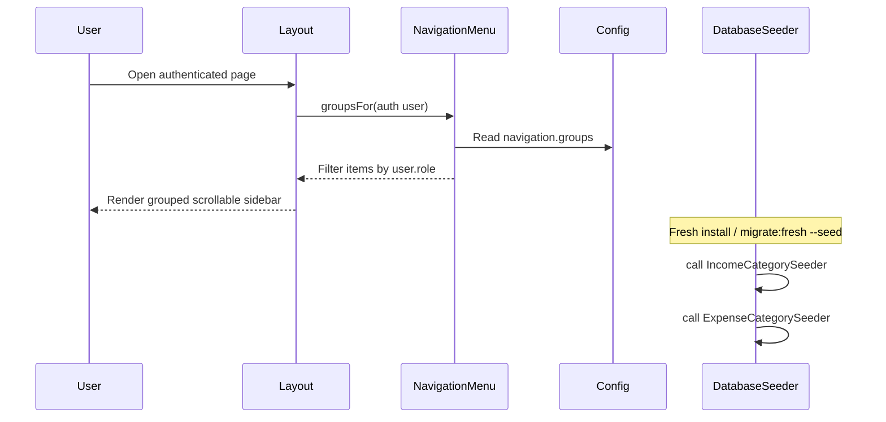

# Phase 6, Epic 1 - Foundation, Navigation, And Seeders Sequence

## Purpose

This document explains the grouped sidebar navigation, role-based link filtering, and finance category seeding added in Phase 6 Epic 1.

## Sequence Flow

## Manual QA

1. Log in as **Admin** (`admin@zarliminnew.test` / `password`).
2. Open **Dashboard** and confirm sidebar shows all five group headings:
   - Main Features
   - Management
   - Configurations
   - Finance
   - Reports
3. Confirm **Go to POS** button is visible for Admin.
4. Click links from each group and confirm pages load (POS, Products, Income Categories, Income, Stock Reports).
5. Resize the browser window to a short height and confirm the sidebar link area scrolls while logo and user footer stay fixed.
6. Log in as **Stock Manager** (`stock_manager@zarliminnew.test` / `password`).
7. Confirm **Go to POS**, **Patient Visits**, and **Finance Summary** are not shown.
8. Confirm **Management** and **Stock Reports** links still appear.
9. Run `php artisan migrate:fresh --seed`.
10. Open **Income Categories** and **Expense Categories** and confirm default categories exist without manual setup.

## Database Checks

- After seeding, `income_categories` contains at least **Consultation Fee**, **Service Fee**, and **Other Income**.
- After seeding, `expense_categories` contains at least **Rent** and **Salary**.
- No new tables were added in Epic 1.

## Configuration Checks

- Navigation groups live in `config/navigation.php`.
- Sidebar rendering lives in `resources/views/layouts/partials/sidebar.blade.php`.
- Role filtering uses `App\Support\NavigationMenu`.
