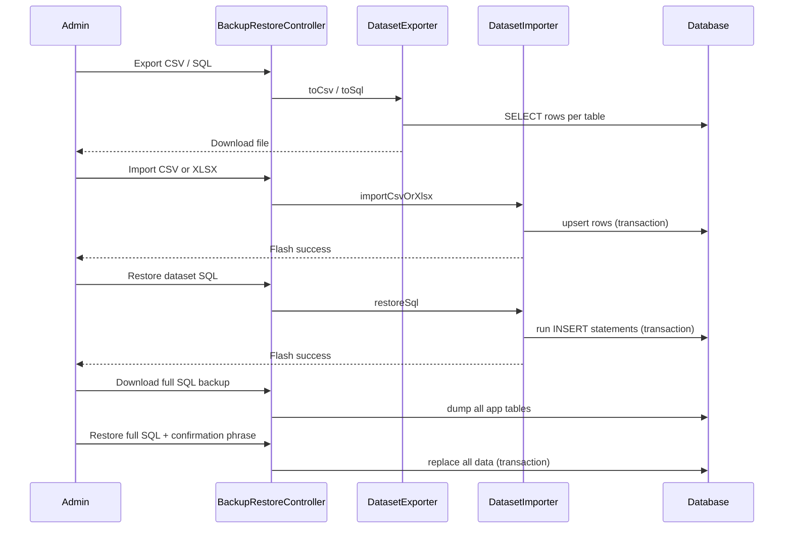

# Phase 6, Epic 10 - Backup, Restore, And Module Data Exchange

## Sequence

## Manual QA

1. Log in as **admin@zarliminnew.test**.
2. Open **Management → Backup & Restore**.
3. **Suppliers:** click **Export CSV**, open file — confirm `#TABLE:suppliers` header and rows.
4. Delete a supplier in the UI, then **Import** the CSV — supplier returns.
5. **Product Catalog:** **Export SQL**, then **Restore SQL** with **Replace** unchecked on a copy DB only.
6. **Full database:** **Download SQL backup** — file downloads. On a test environment only, restore with phrase `RESTORE DATABASE`.
7. Log in as **cashier** — page must be **403 Forbidden**.
8. Check **audit_logs** for `backup.dataset.exported` and `backup.dataset.imported`.
