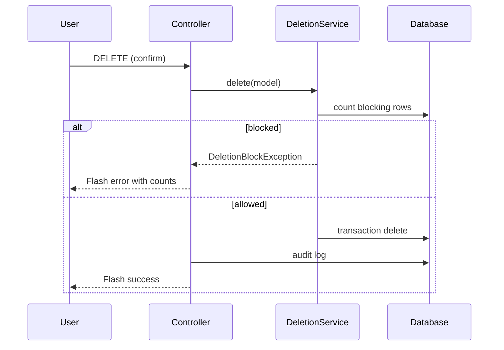

# Phase 6, Epic 11 - Configuration Master Data Delete (Safe CRUD)

## Sequence

## Manual QA

1. Log in as **admin** or **pharmacist**.
2. Create a **supplier** with no receipts → **Delete** succeeds.
3. Create a **purchase receipt** for that supplier → **Delete** supplier shows block message.
4. Create a **product** (no sales/stock) → **Delete** succeeds; units removed.
5. Complete a **POS sale** for a product → **Delete** product is blocked.
6. Create **income category** with an income entry → delete blocked.
7. As **admin**, try to delete your own user → blocked.
8. As **cashier**, open product list → no delete route access (redirect from destroy).
