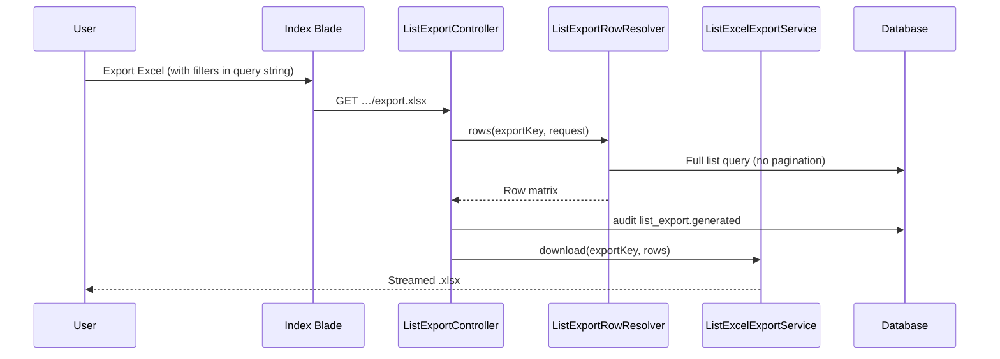

# Phase 6, Epic 12 - List Screen Excel Export

## Sequence

## Manual QA

1. Log in as **pharmacist** → **Products** → **Export Excel** → file downloads; open in Excel; headers match table (no Action column); all products listed.
2. Enter **search** on products → export again → only matching rows.
3. **Product Categories**, **Suppliers**, **Income Categories**, **Expense Categories** → export includes every row on screen.
4. Log in as **cashier** → **Income** with date filter and **Pharmacy Sale** category → export has only sales rows.
5. **Expenses** with category filter → export respects filter; dates show `M d, Y`.
6. Log in as **cashier** → open **Products** export URL → redirected to dashboard (no permission).
7. Log in as **stock manager** → export products/categories/suppliers works; income export denied.
