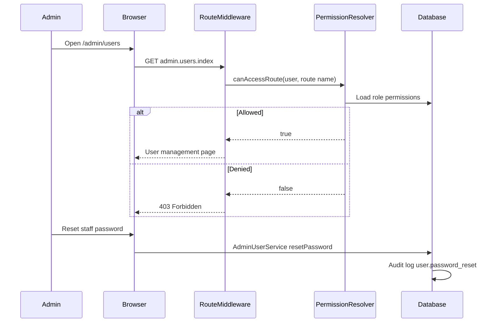

# Phase 6, Epic 2 - Administration And Access Control Sequence

## Purpose

This document explains user management, role-based permissions (screen + route), password reset, and how access checks replaced hard-coded `role:*` middleware.

## Sequence Flow

## Manual QA

1. Run `php artisan migrate:fresh --seed`.
2. Log in as **Admin** (`admin@zarliminnew.test` / `password`).
3. Open **Configurations → Users** and create a cashier user.
4. Log out and log in as the new cashier; confirm POS and Income are available.
5. Confirm cashier cannot open **Configurations → Users** (403).
6. Log back in as admin; open **Roles & Permissions**.
7. Edit **Cashier** and remove `route.sales.pos`; save.
8. Log in as cashier again and confirm POS route returns 403.
9. Restore POS permission for cashier.
10. As admin, edit a user and use **Reset Password**; log in as that user with the new password.
11. Deactivate a user (`Active` unchecked); confirm login shows inactive error.
12. Log in as **Stock Manager** and confirm finance routes and POS are blocked.

## Database Checks

- `roles` has 4 system roles.
- `permissions` has screen and route rows (`screen.*`, `route.*`).
- `role_permission` maps roles to permissions.
- `users.role_id` references `roles`; legacy `users.role` column is removed.
- `users.is_active` defaults to true.

## Security Checks

- Password reset is audited without storing plaintext passwords.
- Role permission updates are audited as `role.permissions_updated`.
- Admin role cannot be stripped of access through the permissions UI.
