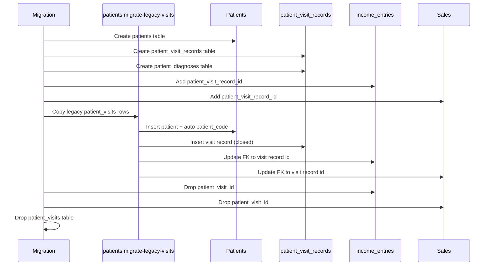

# Phase 6, Epic 3 - Patient Schema And Legacy Migration Sequence

## Purpose

Epic 3 replaces the Phase 4 `patient_visits` table with a normalized patient module: `patients`, `patient_visit_records`, and `patient_diagnoses`. Existing finance and sales links move to `patient_visit_record_id`. Legacy Phase 4 routes (`patient-visits.*`) remain as a compatibility bridge until Epic 4 UI.

## Sequence Flow

## Compatibility Bridge

- Route name stays `patient-visits.*`; model binding resolves `{patient_visit}` to `PatientVisitRecord`.
- Forms still post `patient_name`, `age`, `visited_at`; service creates/updates linked `Patient`.
- Finance/POS forms may still use input name `patient_visit_id`; backend maps to `patient_visit_record_id`.

## Manual QA

1. Run `php artisan migrate:fresh --seed`.
2. Log in as **Cashier** (`cashier@zarliminnew.test` / `password`).
3. Open **Patient Visits → Create**; enter name, age, visit time; save.
4. Confirm detail page shows **Patient ID** (`PAT-YYYYMMDD-####`), name, and age.
5. Click **Record Service Income**; confirm visit is pre-selected; save income entry.
6. Open **Finance → Income**; confirm entry lists linked visit/patient code.
7. Open **POS**; optionally select a patient visit; complete a sale.
8. Open **Sales History** and sale detail; confirm patient code/name appears (not raw id).
9. Open **Reports → Income Report**; filter by patient visit; confirm filtered rows.
10. Run `php artisan test --filter=Phase6Epic3PatientSchemaTest`.

## Database Checks

- `patients`: `patient_code`, `name`, `age`, `address`, `created_by`.
- `patient_visit_records`: `patient_id`, `visited_at`, `status`, `created_by`.
- `patient_diagnoses`: `patient_visit_record_id`, `diagnosis_text`, `recorded_at`, `recorded_by`.
- `income_entries.patient_visit_record_id` nullable FK; old `patient_visit_id` removed.
- `sales.patient_visit_record_id` nullable; old `patient_visit_id` removed.
- `patient_visits` table does not exist after migrations.

## Audit Checks

- New visit: `patient_visit_record.created` with patient code/name in payload.
- Update visit: `patient_visit_record.updated` with old/new patient name and age.
- Diagnosis CRUD (Epic 4 UI): `patient_diagnosis.created` / `patient_diagnosis.updated`.

## Notes

- Legacy migration sets patient `address` to `-` when unknown.
- Migrated legacy visits get `status = closed`.
- Patient management UI is implemented in Epic 4.
