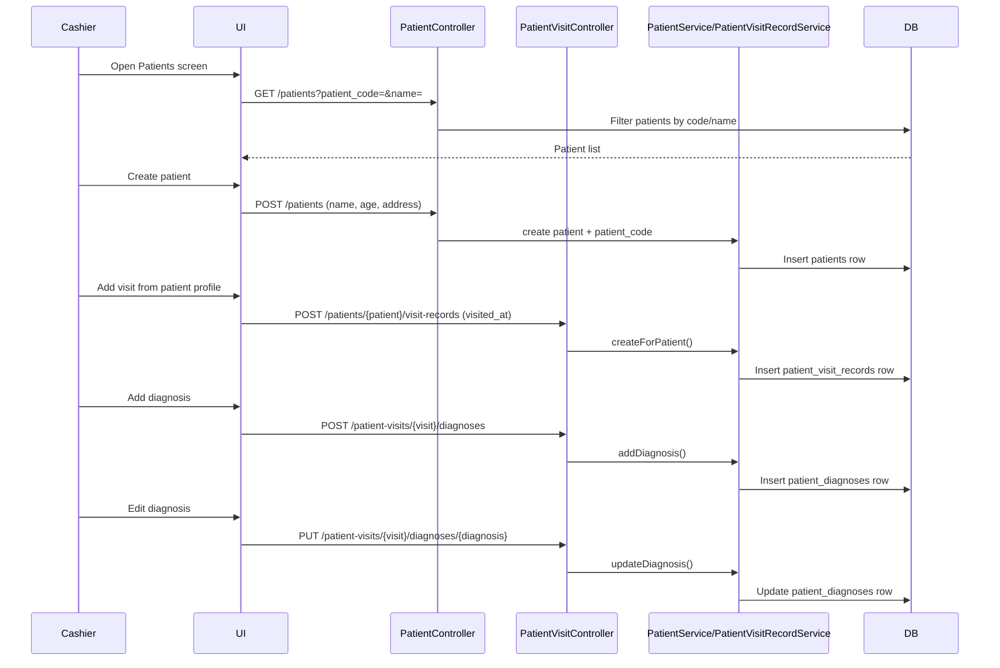

# Phase 6, Epic 4 - Patient Management UI Sequence

## Purpose

Epic 4 delivers the patient-facing workflows on top of Epic 3 schema:
- Patient list/search and create/edit profile
- Patient detail with visit history
- Patient-scoped visit record create/edit
- Stackable diagnosis add/edit
- Visit detail with linked income actions

## Sequence Flow

## Manual QA

1. Run `php artisan migrate:fresh --seed`.
2. Log in as **Cashier** (`cashier@zarliminnew.test` / `password`).
3. Open **Main Features → Patients**.
4. Create a patient with name, age, and address.
5. Search patient by `patient_code` and by partial name.
6. Open patient detail and click **New Visit**.
7. Create visit record with visit datetime only.
8. Open visit detail; add two diagnosis entries and edit one.
9. Confirm diagnoses display in chronological order.
10. Click **Record Service Income**, save an income entry, and verify it appears in linked income table.
11. Run `php artisan test --filter=Phase6Epic4PatientManagementUiTest`.

## Permission Checks

- Cashier can access `patients.*`, `patients.visit-records.*`, and diagnosis actions under `patient-visits.*`.
- Stock manager is still blocked from patient and finance routes.
- Sidebar now shows **Patients** by `screen.patients` permission.

