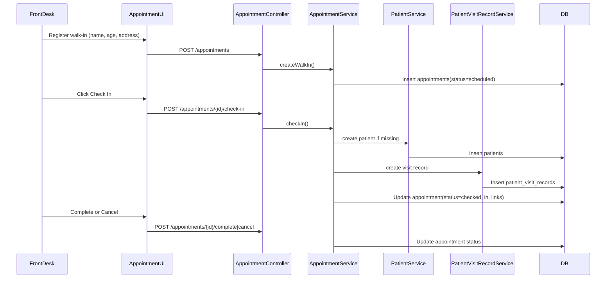

# Phase 6, Epic 5 - Appointments Same-Day Intake Sequence

## Purpose

Epic 5 introduces same-day appointment intake for front desk workflow. Walk-ins are registered first, then checked in to create linked patient and visit records.

## Sequence Flow

## Manual QA

1. Run `php artisan migrate:fresh --seed`.
2. Log in as **Cashier** (`cashier@zarliminnew.test` / `password`).
3. Open **Appointments** in sidebar.
4. Register a walk-in appointment with name, age, and address.
5. Confirm appointment appears on list filtered to today by default.
6. Click **Check In** and verify:
   - status becomes `checked_in`
   - `patient_id` and `patient_visit_record_id` are set
7. Click **Complete** and confirm status becomes `completed`.
8. Register another walk-in, check in, then click **Cancel** and confirm status becomes `cancelled`.
9. Call `GET /appointments/today-queue` while logged in and confirm max 20 active rows with `display_name`, `patient_code`, `status`, `patient_visit_record_id`.
10. Log in as **Stock Manager** and confirm appointments routes are forbidden.

## Database Checks

- `appointments` includes guest fields, `appointment_date`, status enum values, nullable `patient_id`, and nullable `patient_visit_record_id`.
- Check-in creates linked rows in `patients` and `patient_visit_records`.
- Completed/cancelled appointments are not returned by today queue API.

