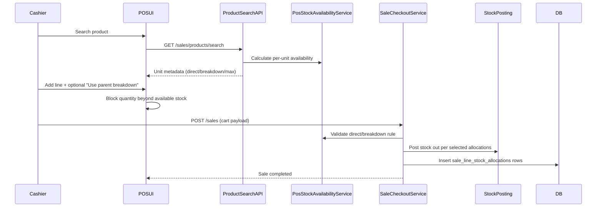

# Phase 6, Epic 6 - POS Stock Validation And Parent-Unit Breakdown

## Purpose

Epic 6 adds POS-time stock availability checks and explicit parent-unit breakdown support. Cashier can only add quantities that are available, and checkout persists exact stock allocation sources.

## Sequence Flow

## Manual QA

1. Run `php artisan migrate:fresh --seed`.
2. Log in as **Cashier** and open POS.
3. Search a product that has only parent-unit stock.
4. Confirm sale units show availability metadata and max quantity.
5. Try adding quantity above max; confirm POS blocks/reduces quantity.
6. Keep parent breakdown disabled and set quantity above direct stock; confirm UI blocks and shows message.
7. Enable parent breakdown and complete sale successfully.
8. Confirm `sale_line_stock_allocations` has rows with `allocation_type = parent_breakdown`.
9. Run `php artisan test --filter=SaleCheckoutTest`.

## Database Checks

- `sale_line_stock_allocations` stores source unit and quantities used for each sale line.
- `sale_lines.use_parent_breakdown` stores cashier decision for hold/resume/checkout consistency.
- Stock balances and stock ledgers match persisted allocation rows.

