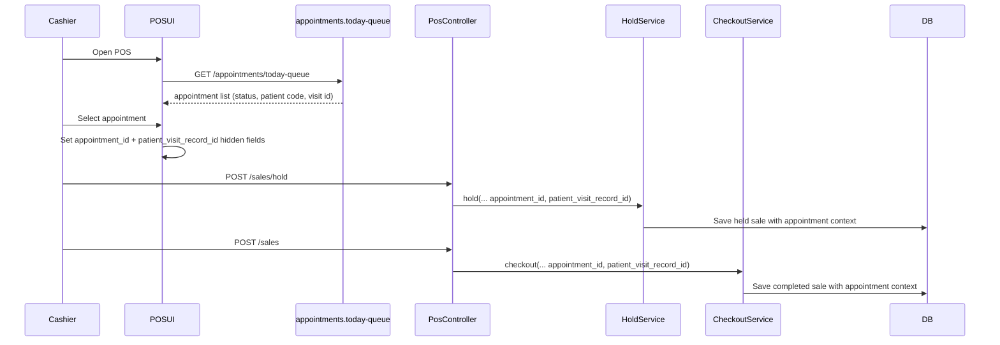

# Phase 6, Epic 7 - POS Appointment Integration Sequence

## Purpose

Epic 7 links POS sales with same-day appointments. Cashier selects from today queue, and POS carries `appointment_id` and `patient_visit_record_id` through hold/resume/checkout.

## Sequence Flow

## Manual QA

1. Run `php artisan migrate:fresh --seed`.
2. Log in as cashier and create/check-in one appointment.
3. Open POS and confirm appointment dropdown loads today queue entries.
4. Select appointment and complete a sale.
5. Verify `sales.appointment_id` and `sales.patient_visit_record_id` are populated.
6. Hold a sale with appointment selected, resume it, and confirm appointment context is still selected.
7. Open sales detail/receipt and confirm patient/guest display falls back correctly:
   - checked-in appointment shows patient code + guest name
   - no selection shows `No patient`.

## Database Checks

- `sales.appointment_id` nullable FK exists.
- Held and completed sales preserve selected appointment context.
- Sales without appointment remain valid.

