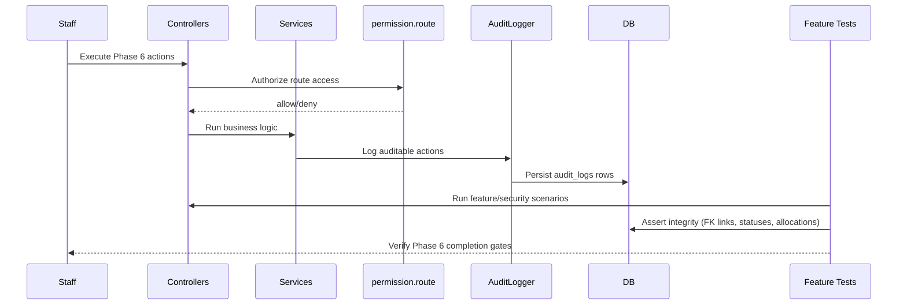

# Phase 6, Epic 8 - Audit, Security, QA, And Documentation Sequence

## Purpose

Epic 8 closes Phase 6 by validating audit coverage, permission boundaries, and cross-epic reliability from administration through POS completion.

## Sequence Flow

## Audit Coverage Verified

- Administration: user create/update/reset password, role permission updates.
- Patient module: `patient.created`, `patient.updated`, visit and diagnosis events.
- Appointments: `appointment.created`, `appointment.checked_in`, `appointment.completed`, `appointment.cancelled`.
- Sales: hold, checkout completion, void, stock posting and allocation persistence.

## Security Coverage Verified

- New routes remain under `auth` + `permission.route`.
- Stock manager blocked from cashier-only patient/appointment/POS routes.
- Queue API for POS (`appointments.today-queue`) is protected by route permission.

## Manual QA

1. Run `php artisan migrate:fresh --seed`.
2. Validate role boundaries:
   - Cashier can access POS, appointments, patient flows.
   - Stock manager gets 403 on POS/appointments/patient routes.
3. Register and check in appointment, then complete sale from POS queue selection.
4. Hold and resume sale while retaining appointment context.
5. Confirm sales detail/receipt patient context fallback behavior.
6. Review `audit_logs` for appointment and patient action entries.
7. Run full suite: `php artisan test`.

## Completion Notes

- Flow documents now exist for Epics 1 through 8.
- Optional PRD success-metric wording review is pending explicit user approval before any PRD edit.

